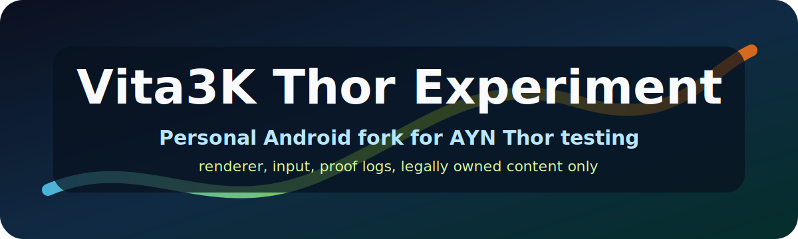

# Vita3K Thor Experiment

<p align="center">
  
</p>

<p align="center">
  
</p>

This is a personal Android fork of [Vita3K](https://github.com/Vita3K/Vita3K) for the AYN Thor. It is tuned around handheld testing, renderer/input experiments, and local proof logs. It is not upstream Vita3K, not an official release channel, and not trying to be a general-purpose support project.

> [!WARNING]
> This fork is vibe coded with AI assistance. That is intentional and disclosed. If AI-assisted code, docs, or generated assets bother you, this repo is not for you. Use upstream Vita3K or another fork.

> [!CAUTION]
> Personal-use experiment. No guarantee of stability, compatibility, correctness, performance, support, or future updates. No games, license files, firmware, keys, or copyrighted game content are included. Use your own legally dumped content and homebrew.

## What This Is

- Android-focused Vita3K fork for AYN Thor Base/Pro/Max testing.
- A place for Thor renderer, graphics-driver, input, touch, scaling, and suspend/resume experiments.
- Built around Android `arm64-v8a` APK checks, not desktop release packaging.
- Uses upstream Vita3K documentation as the baseline for emulator setup and build expectations.
- Uses Thor proof logs, screenshots, and short videos when a game or setting is called working.

## Target Hardware

Optimization work assumes AYN Thor Base/Pro/Max hardware: Snapdragon 8 Gen 2, Adreno 740, active cooling, LPDDR5X, and UFS4 storage. Thor Lite is a different Snapdragon 865 / Adreno 650 target and should not drive defaults unless explicitly called out.

## What This Is Not

- Not upstream Vita3K.
- Not a supported emulator distribution.
- Not a compatibility reporting project.
- Not a place to request games, licenses, firmware, keys, copyrighted files, or piracy help.
- Not a promise that any game, renderer setting, controller mapping, or performance tweak will work for your copy of a game.

## Support And Issues

Do not open issues expecting support for this experiment. Fork it, test it, patch it, and own the result. If the AI/vibe-coded nature of this fork is a problem, look elsewhere.

The upstream Vita3K project has its own rules, standards, and support expectations. Do not send Thor-experiment problems to upstream Vita3K.

## How This Fork Differs From Upstream

Upstream Vita3K is the main emulator project. This fork is a personal Android build tuned for AYN Thor handheld testing. The main difference is convenience: this fork tries to make common handheld emulator tasks easier from the device itself.

## Features For Normal Users

These are the practical differences you should notice first compared with upstream Vita3K Android.

- Easier graphics driver setup: download Turnip driver ZIPs from GitHub, see the suggested Thor/Adreno 740 choice, install a driver, select it, and delete old downloaded ZIPs from inside the app.
- Play ZIP as Cartridge: launch `.zip` and `.vpk` Vita archives directly without adding them to the normal installed Vita3K library first.
- Better ROM folder scanning: scan common `/sdcard/roms/psvita` and SD-card folders, detect some translated or nonstandard ZIP layouts, and keep cached game icons/backgrounds so the list does not need a full archive scan every launch.
- Clear library badges: encrypted virtual cartridges show an `E` badge instead of failing mysteriously, and games with matching cheat files show a `C` badge.
- In-game OSD menu: press Back during gameplay to open a controller-friendly menu for resume, pause, save/load state, fast-forward speed, screenshots, renderer trace, and cheats.
- Thor controller shortcuts: `Select + R1` toggles fast-forward, `Select + right-stick down` saves state, and `Select + right-stick up` loads state.
- Fast-forward presets: choose Off, 2x, 3x, or 4x from the OSD. Fast-forward avoids high-pitched chipmunk audio by using pitch-preserving tempo filtering when available, or normal-pitch buffer skipping when that filter is missing.
- Per-game quickstate slot: save/load slot 0 for the current game from the OSD or shortcuts.
- VitaCheat panel: load `.psv` cheat files from supported cheat folders, show available cheats in the OSD, and toggle individual cheats per game.
- Thor testing tools: ADB scripts can capture screenshots, logs, crash info, memory info, frame stats, and renderer trace notes while testing on the real device.

## Experimental Or Unfinished Features

These are useful, but they are not as mature as polished emulator release features yet.

- Save states are experimental. Same-session save/load is the current focus; app-restart durability is still being expanded toward PPSSPP-style reliability.
- Direct ZIP cartridge mode does not decrypt games, bypass licenses, or replace proper dumping. If a ZIP contains encrypted/PFS content, this fork should report that clearly and stop.
- Cheat support handles a useful subset of VitaCheat codes, but not every code type. Unsupported code types are skipped instead of guessed.
- Renderer trace and profile tools are for debugging broken games or graphics issues. They are not normal-user settings you need to leave on.

## Technical Differences For Developers

This section is for people changing the emulator code, debugging games, or comparing this fork with upstream Vita3K internals.

- Android `arm64-v8a` APKs and real AYN Thor testing are the main path. Desktop builds still follow upstream expectations, but desktop packaging is not the priority here.
- Direct ZIP cartridge mode mounts `app0:` against the archive and applies read-time `patch`/`rePatch` overlays. It does not bypass encryption, licenses, or ownership checks.
- Large deflated archive members, including multi-gigabyte `.psarc` files, are cached to app-local storage instead of inflated into RAM.
- Fast-forward updates display/vblank pacing, guest kernel clock/wait timing, AVPlayer video pacing, and SDL audio tempo together.
- SDL fast-forward audio keeps SDL's stream frequency ratio at `1.0x`. It uses FFmpeg `atempo` for pitch-preserving tempo changes when possible, with normal-pitch buffer skipping as the fallback.
- Quickstates currently serialize CPU contexts, allocated guest memory pages, and allocator maps. The next durability targets are kernel objects, GPU/display state, audio, AVPlayer/movie state, IO/VFS handles, and renderer cache state.
- `--thor-render-trace` adds GXM/Vulkan trace logs, including scene, draw, surface, and texture upload details for renderer debugging.
- Thor-only behavior should stay behind settings, build flags, device checks, or clearly named code paths.
- Broad Vita3K fixes should stay clean enough to propose upstream separately.
- No game files, firmware, license files, or commercial content should be committed here.

## Questions This Fork Should Answer

- Which Vita3K Android renderer and graphics-driver settings behave best on AYN Thor?
- Which games are useful Thor canaries for fast regression testing?
- Can physical controls, front touch, rear touch, analog input, audio, save/load, and suspend/resume all survive real handheld use?
- Which performance changes are general Vita3K improvements, and which ones should stay Thor-only?
- What proof is enough before calling a game or setting working: screenshot, logcat, frame pacing, controller proof, save proof, or all of them?

## Thor Screenshot

No live Thor screenshot is checked in yet. When one is added, use a real device screenshot from this fork and make clear that no games are bundled with this repository.

Suggested path:

```text
docs/media/screenshots/vita3k-thor-android.png
```

## Build Locally

This fork is currently aimed at Android/AYN Thor APK experiments:

```powershell
git submodule update --init --recursive
Copy-Item -Recurse -Force data android/assets
Copy-Item -Recurse -Force lang android/assets
Copy-Item -Recurse -Force vita3k/shaders-builtin android/assets
.\gradlew.bat assembleReldebug
```

APK output:

```text
android/build/outputs/apk/reldebug/android-reldebug.apk
```

Desktop builds still follow the upstream-style instructions in [`building.md`](./building.md).

## Content And Firmware

Vita3K-Thor does not include PlayStation Vita games, firmware, licenses, keys, or copyrighted game content. Use legally dumped content and homebrew only.

Useful upstream/user resources:

- [Vita3K quickstart](https://vita3k.org/quickstart)
- [Vita3K compatibility list](https://vita3k.org/compatibility.html)
- [Vita3K homebrew compatibility list](https://vita3k.org/compatibility-homebrew.html)
- [VitaDB homebrew](https://www.rinnegatamante.eu/vitadb/#/)

## Remotes

- Writable fork: `git@github.com:noeldvictor/Vita3K-Thor.git`
- Upstream reference: `https://github.com/Vita3K/Vita3K`

Clone this fork with SSH:

```sh
git clone --recursive git@github.com:noeldvictor/Vita3K-Thor.git
cd Vita3K-Thor
```

## Upstream Credit

Vita3K is an open-source PlayStation Vita emulator. This fork exists because upstream Vita3K and many emulator contributors did the real foundational work.

This repository remains under the upstream license terms. See [`COPYING.txt`](./COPYING.txt).

PlayStation, PlayStation Vita, and PlayStation Network are registered trademarks of Sony Interactive Entertainment Inc. This fork is not related to or endorsed by Sony, Vita3K upstream, or any commercial game publisher.
