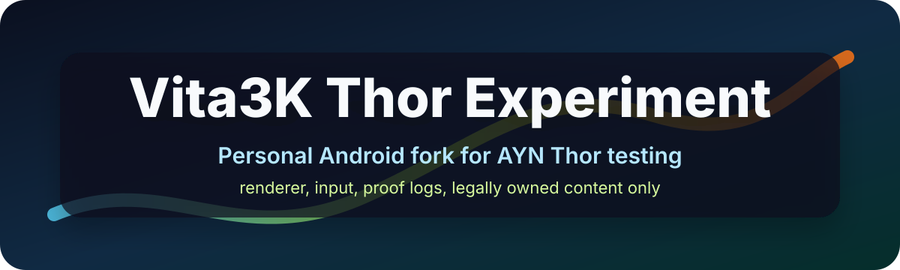

# Vita3K Thor Experiment

<p align="center">
  
</p>

<p align="center">
  
</p>

A personal Android fork of [Vita3K](https://github.com/Vita3K/Vita3K) for the
AYN Thor. It is tuned around handheld testing, renderer and input experiments,
and local proof logs. It is not upstream Vita3K, not a release channel, and not
a support project.

> [!WARNING]
> **Extremely unstable research build.** I am testing out stuff; don't waste
> your time on it right now. The fork is vibe coded with AI assistance, on
> purpose and disclosed. If AI-assisted code, docs or generated assets bother
> you, use upstream Vita3K or another fork.

> [!CAUTION]
> Personal-use experiment. No guarantee of stability, compatibility,
> correctness, performance, support, or future updates. No games, license
> files, firmware, keys, or copyrighted game content are included. Use your own
> legally dumped content and homebrew.

## What this is, and is not

- An Android `arm64-v8a` fork for AYN Thor Base/Pro/Max: Snapdragon 8 Gen 2,
  Adreno 740, active cooling, LPDDR5X, UFS4. Thor Lite (Snapdragon 865) does
  not drive any default.
- A place for renderer, graphics-driver, input, touch, scaling and
  suspend/resume experiments, checked on the real device with screenshots,
  logs and short videos before anything is called working.
- Tracking upstream: the Qt desktop frontend, the Compose Android app and the
  `FrameHost` renderer are upstream's; upstream is merged regularly.
- Not a supported distribution, not a compatibility reporting project, and not
  a place to ask for games, licenses, firmware, keys or piracy help.

Do not open issues expecting support. Fork it, test it, patch it, own the
result. Do not send Thor-experiment problems to upstream Vita3K either; they
have their own rules and standards.

## Getting games onto the Thor

Put legally dumped games on the SD card under `Roms/psvita` (or
`/sdcard/roms/psvita` and the usual Emulation folder variants) and they appear
in the app grid as virtual cartridges. Nothing is installed into the emulated
`ux0:app`; a cartridge is mounted read-only for the session.

Two forms work, and they are not equal:

| Form | What happens on launch |
|---|---|
| **Extracted folder** — `Roms/psvita/<Game>/sce_sys/param.sfo` | Mounted straight from the card. No cache, no first-launch wait. **Use this.** |
| **`.zip` / `.vpk`** | Mounted through the archive reader, with `patch/` and `rePatch/` folders folded over the game. Any file over 64 MiB (PSARC archives, movies) is unpacked once into a cache on internal storage, because a compressed zip entry cannot be read at an offset. Trails in the Sky FC costs 2.8 GB of that. |

If you already have zips on the card, `python tools/unpack_cartridges.py
--delete --purge-cache` turns them into folders on the device itself, checks
every file against the zip listing, folds the patches in, and only then removes
the zip and that game's cache. `--dry-run` shows the plan first.

The cache is visible and manageable in **Settings → Emulator → Cartridge
Cache**: size per game, free space, delete one or all. Deleting only costs that
game a re-extraction on its next launch.

Encrypted (PFS) content is detected and refused with an `E` badge. This fork
does not decrypt games, bypass licenses, or replace proper dumping.

## Features for normal users

These are the practical differences from upstream Vita3K Android.

- **Cartridges, not installs**: zips, vpks and extracted folders launch from
  the card. Translated and nonstandard archive layouts are recognised; game
  icons and backgrounds are cached so the list does not rescan every archive at
  startup.
- **Cartridge cache manager** in Settings, as above.
- **Library badges**: `E` for encrypted content that cannot boot, `C` for a
  game with matching VitaCheat files.
- **Graphics driver setup from the device**: download Turnip driver zips from
  GitHub, see the suggested Thor / Adreno 740 choice, install, select, and
  delete old downloads inside the app.
- **Pause menu** during play: resume, save/load state, fast-forward presets,
  screenshots, renderer trace and cheats, all controller-navigable (D-pad
  moves, A activates, B goes back).
- **Thor controller shortcuts**: `Select + R1` toggles fast-forward,
  `Select + right-stick down` saves state, `Select + right-stick up` loads it.
- **Fast-forward that is honest**: 2x/3x/4x presets, the multiplier shown on
  screen even when the FPS overlay is off, and pitch-preserving audio through
  FFmpeg `atempo` (normal-pitch buffer skipping when that filter is missing).
- **Per-game quickstates**: a disk-backed slot 0 per game, with an undo slot
  taken before every load so a bad load can be reverted.
- **VitaCheat**: `.psv` files from the supported cheat folders are listed per
  game and can be toggled individually.
- **Offline PSN**: new configs default to Vita3K's local `psn-signed-in` mode so
  games do not stall on sign-in errors while offline.
- **Japanese games**: switch the system confirm button between O and X, and set
  a per-game X/O swap for titles whose in-game confirm/cancel feels backwards.

## Current maturity notes

- Quickstates pass a Windows durability gate (restart load, save-again,
  same-session load, undo-load, five-cycle soak, corrupt-primary fallback,
  custom state root, compression) for the UPPERS and DOA Venus canaries. That
  is not a blanket all-games claim; wider coverage and the Android/Thor proof
  are tracked separately and unsafe loads refuse with a marker instead of
  guessing.
- Cheat support handles a useful subset of VitaCheat code types; unsupported
  ones are skipped, not guessed.
- Renderer trace and profiling tools exist for debugging broken games. They are
  not settings to leave on.
- Games known to boot on the Thor as cartridges as of 2026-09-07 include the
  three Trails in the Sky Evolution titles, UPPERS, DOA Xtreme 3 Venus, Chaos
  Rings III and Uncharted: Golden Abyss. "Boots" is not "finished"; the
  compatibility ledger in `reports/debug_knowledge.sqlite` is the record.

## For developers

Two documents run this repo:

- [`AGENTS.md`](./AGENTS.md) is the rulebook: goals and scope, git conventions,
  the SQLite debug knowledge base and its anti-loop rules, input automation,
  build notes, cartridge and cheat rules, device etiquette, and what a "works"
  claim needs.
- [`CLAUDE.md`](./CLAUDE.md) is the map: build commands, how cartridges mount,
  the MCP server that drives the Thor, and the traps that have already cost a
  day each.

The short version of what is different under the hood:

- Cartridge mode mounts `app0:` against an archive or a folder and applies
  `patch`/`rePatch` overlays at read time; it never decrypts anything. A
  cartridge is never installed, so any code that looks for game files under
  `ux0:app` is wrong for it (that footgun has been fixed four times).
- Large archive members are cached to app-local storage rather than inflated
  into RAM.
- Fast-forward scales the kernel clock, the vblank, audio tempo and video
  pacing together.
- Quickstates serialize CPU contexts, guest memory, allocator maps and named
  metadata sections for the kernel, GXM, IO, display, audio, codecs and NGS,
  with CRC-checked, temp-file-replaced saves and a fail-closed restore. The
  full gate list lives in `AGENTS.md`.
- `--thor-render-trace` adds GXM/Vulkan scene, draw, surface and texture
  upload logging for renderer debugging.
- Thor-only behaviour stays behind settings, build flags or clearly named code
  paths; broad Vita3K fixes stay clean enough to propose upstream separately.

### Renderer canary fixes

Local test canaries, not bundled content, useful because they exposed real
emulator bugs:

- **UPPERS (`PCSG00633`)**: shader repeat handling, Vita-style depth clipping
  and Android present alpha, so character parts and foreground slabs no longer
  vanish or draw in the wrong place.
- **DOA Xtreme 3 Venus (`PCSH00250`)**: stale vertex data, depth textures
  sampled before they were ready, BCn decode and alpha/depth side selection
  for a few transparent materials.
- **Trails in the Sky FC/SC/3rd Evolution (`PCSG00488`–`PCSG00490`)**: a
  cartridge never got its bundled `libfios2` preloaded, so the firmware one
  rejected the game's FIOS init and no PSARC mounted. FC was a black screen.

### Build locally

```powershell
git submodule update --init --recursive
$env:ANDROID_NDK_HOME = Join-Path $env:LOCALAPPDATA 'Android\Sdk\ndk\29.0.14206865'
$env:VCPKG_ROOT = 'C:\path\to\vcpkg'
cd android
.\gradlew.bat assembleReldebug -Pandroid.injected.build.abi=arm64-v8a
```

The APK lands in `android/app/build/intermediates/apk/reldebug/app-reldebug.apk`
and is marked `testOnly`, so install it with `adb install -r -t`. The first
build compiles the vcpkg manifest dependencies from source; later builds reuse
them. Assets are read from `android/assets` directly.

Desktop builds need Qt 6.11+:

```powershell
cmake --preset windows-vs2022 -DVITA3K_ENABLE_QT_GUI=ON
cmake --build build/windows-vs2022 --config RelWithDebInfo -- -m
```

### Automating the dev loop

`tools/mcp_server.py` exposes build, install, launch, drive and observe over
MCP so an agent can work the Thor without a human relaying commands, including
button and touch injection below SDL, the emulator's own log, screenshots that
refuse when another app is on top, config A/B without a rebuild, the guest
filesystem, and a Cheat Engine style memory search. It is off by default:
`python tools/mcp_toggle.py on|off|status`. `CLAUDE.md` documents every tool.

## Content and firmware

Vita3K Thor does not include PlayStation Vita games, firmware, licenses, keys,
or copyrighted game content. Use legally dumped content and homebrew only.

- [Vita3K quickstart](https://vita3k.org/quickstart)
- [Vita3K compatibility list](https://vita3k.org/compatibility.html)
- [Vita3K homebrew compatibility list](https://vita3k.org/compatibility-homebrew.html)
- [VitaDB homebrew](https://www.rinnegatamante.eu/vitadb/#/)

## Remotes

- Writable fork: `git@github.com:noeldvictor/Vita3K-Thor.git`
- Upstream reference: `https://github.com/Vita3K/Vita3K`

```sh
git clone --recursive git@github.com:noeldvictor/Vita3K-Thor.git
```

## Upstream credit

Vita3K is an open-source PlayStation Vita emulator. This fork exists because
upstream Vita3K and many emulator contributors did the real foundational work.
This repository remains under the upstream license terms; see
[`COPYING.txt`](./COPYING.txt).

PlayStation, PlayStation Vita, and PlayStation Network are registered
trademarks of Sony Interactive Entertainment Inc. This fork is not related to
or endorsed by Sony, Vita3K upstream, or any commercial game publisher.
